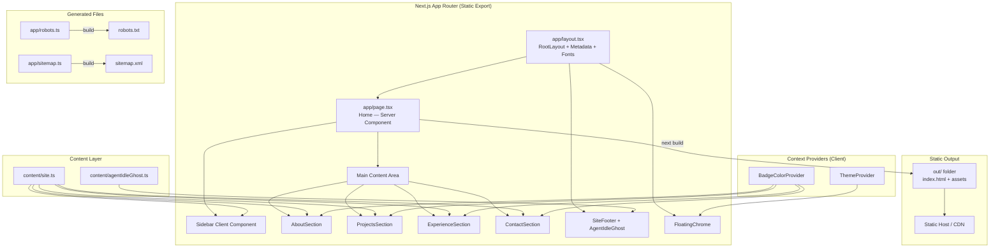
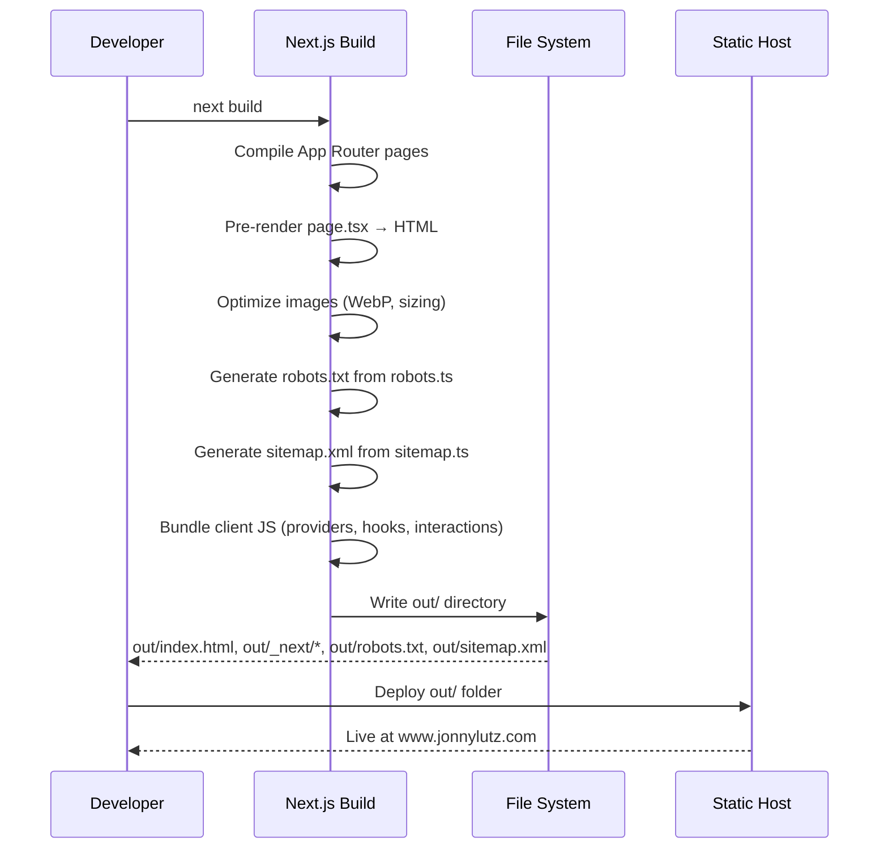
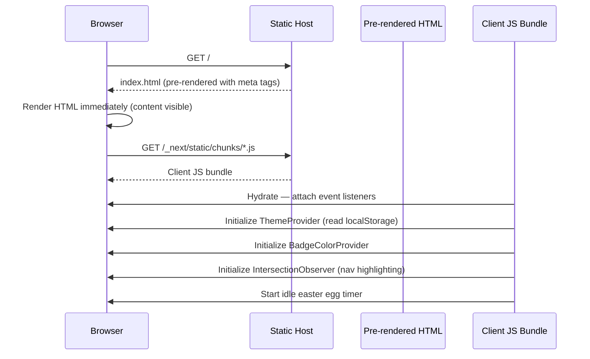
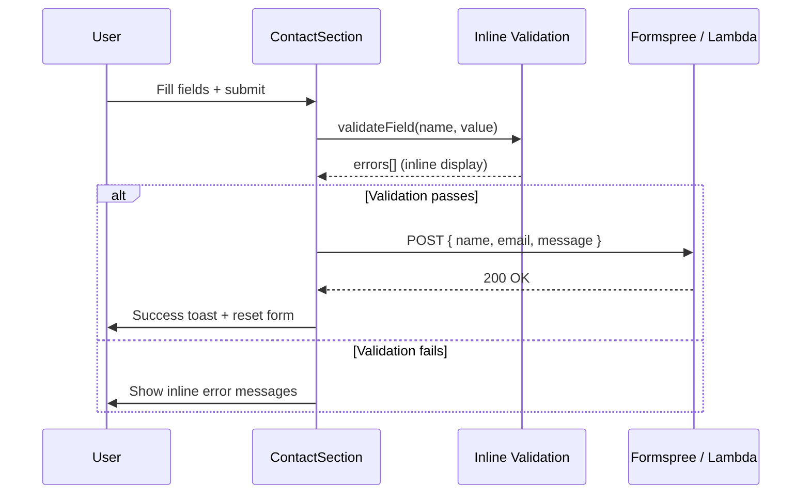

# Design Document: Next.js Portfolio Migration

## Overview

Migrate jonnylutz.com from a Vite-powered React SPA to a Next.js App Router application with static export (`output: 'export'`). The current site renders entirely client-side — crawlers see an empty `<div id="root">` — which kills SEO and social sharing. Next.js static export produces pre-rendered HTML for every route while keeping the same static hosting story (deploy an `out/` folder).

Beyond the framework swap, this migration fixes broken OG/meta tags (currently pointing to GitHub instead of www.jonnylutz.com), introduces automatic image optimization via `next/image`, adds auto-generated `sitemap.xml` and `robots.txt`, expands content (About section, Buckeye Bets project, resume PDF download), adds inline contact form validation, and performs code cleanup (remove unnecessary `useMemo`, derive nav from `site.ts`, add error boundary). The architecture preserves the existing component structure and cyberpunk theme while laying a foundation for a future `/blog` route.

## Architecture



## Sequence Diagrams

### Build & Deploy Flow



### Page Load Flow (User Visit)



### Contact Form Submission



## Components and Interfaces

### Component: RootLayout (`app/layout.tsx`)

**Purpose**: Top-level layout wrapping all pages. Configures fonts via `next/font/google`, sets global metadata via the Metadata API, and wraps children in ThemeProvider.

```typescript
// app/layout.tsx
import type { Metadata } from 'next'
import { Plus_Jakarta_Sans } from 'next/font/google'
import { ThemeProvider } from '@/context/ThemeContext'
import './globals.css'

const jakarta = Plus_Jakarta_Sans({
  subsets: ['latin'],
  variable: '--font-sans',
  display: 'swap',
})

export const metadata: Metadata = {
  metadataBase: new URL('https://www.jonnylutz.com'),
  title: 'Jonathan Lutz · Portfolio',
  description:
    'Jonathan Lutz — front-end engineer at AWS (IoT Console). Agentic software development, React, TypeScript, and production-quality UI.',
  openGraph: {
    type: 'website',
    title: 'Jonathan Lutz · Front-End Engineer Portfolio',
    description:
      'Front-end engineer at AWS working on IoT Console. Specializing in React, TypeScript, and agentic software development.',
    url: 'https://www.jonnylutz.com',
    siteName: 'Jonathan Lutz Portfolio',
    locale: 'en_US',
    images: [{ url: '/og-image.png', width: 1200, height: 630 }],
  },
  twitter: {
    card: 'summary_large_image',
    title: 'Jonathan Lutz · Front-End Engineer Portfolio',
    description:
      'Front-end engineer at AWS working on IoT Console. Specializing in React, TypeScript, and agentic software development.',
    images: ['/og-image.png'],
  },
  authors: [{ name: 'Jonathan Lutz' }],
  robots: { index: true, follow: true },
  alternates: { canonical: 'https://www.jonnylutz.com' },
}

interface RootLayoutProps {
  children: React.ReactNode
}
```

**Responsibilities**:
- Configure `next/font/google` for Plus Jakarta Sans (eliminates external Google Fonts request)
- Set global metadata with correct `www.jonnylutz.com` URLs
- Self-host OG image at `/og-image.png`
- Wrap children in ThemeProvider
- Apply font CSS variable to `<html>`

### Component: HomePage (`app/page.tsx`)

**Purpose**: The single page of the portfolio. Composes all section components. Server Component at the top level, with client components for interactive parts.

```typescript
// app/page.tsx
import { Sidebar } from '@/components/Sidebar'
import { MobileNav } from '@/components/MobileNav'
import { AboutSection } from '@/components/AboutSection'
import { ProjectsSection } from '@/components/ProjectsSection'
import { ExperienceSection } from '@/components/ExperienceSection'
import { ContactSection } from '@/components/ContactSection'
import { SiteFooter } from '@/components/SiteFooter'
import { FloatingChrome } from '@/components/FloatingChrome'
import { ClientProviders } from '@/components/ClientProviders'

export default function HomePage(): JSX.Element
```

**Responsibilities**:
- Compose layout structure (sidebar + main content)
- Conditionally render ProjectsSection based on `site.showProjectsSection`
- Render skip-to-content link
- Delegate interactivity to client components

### Component: ClientProviders

**Purpose**: Wraps client-side context providers (BadgeColorProvider, Toaster, idle easter egg) in a single `'use client'` boundary.

```typescript
// components/ClientProviders.tsx
'use client'

interface ClientProvidersProps {
  children: React.ReactNode
}

export function ClientProviders({ children }: ClientProvidersProps): JSX.Element
```

**Responsibilities**:
- Provide BadgeColorProvider context
- Render Sonner Toaster with theme awareness
- Initialize useIdleEasterEgg hook and pass episodeId to SiteFooter

### Component: ContactSection (Enhanced)

**Purpose**: Contact form with inline field validation in addition to existing Sonner toasts.

```typescript
// components/ContactSection.tsx
'use client'

type FieldErrors = {
  name?: string
  email?: string
  message?: string
}

interface ContactFormState {
  name: string
  email: string
  message: string
}

function validateField(field: keyof ContactFormState, value: string): string | undefined
function validateForm(data: ContactFormState): FieldErrors
```

**Responsibilities**:
- Validate fields on blur and on submit
- Display inline error messages below each field
- Maintain existing Sonner toast behavior for submission results
- Support both Formspree and Lambda backends via environment variables

### Component: Image Optimization

**Purpose**: Replace all `` tags with `next/image` for automatic WebP conversion, lazy loading, and proper width/height attributes.

```typescript
// In ProjectsSection.tsx
import Image from 'next/image'

// Replace:
//   
// With:
//   <Image src={project.image} alt={project.imageAlt} width={1200} height={675} />
```

**Responsibilities**:
- Automatic WebP/AVIF conversion at build time
- Lazy loading by default
- Proper `width` and `height` to prevent CLS
- Static export compatible (uses `next/image` with `unoptimized` or custom loader)

## Data Models

### Site Content Model (Expanded)

```typescript
// content/site.ts — additions

interface SiteConfig {
  name: string
  handle: string
  title: string
  company: string
  tagline: string
  location: string
  showProjectsSection: boolean
  resumePdfPath: string // NEW: '/resume-jonathan-lutz.pdf'
  links: {
    github: string
    linkedin: string
    email: string
    calendly?: string // NEW: optional Calendly link
  }
  about: string[] // EXPANDED: multiple paragraphs for career story
  experience: ExperienceItem[]
  projects: ProjectItem[] // EXPANDED: add Buckeye Bets
  contact: ContactConfig
}

interface ProjectItem {
  title: string
  description: string
  stack?: readonly string[]
  stackBullets?: readonly string[]
  highlights?: readonly string[]
  href?: string
  hrefLabel?: string
  repoHref?: string
  image?: string
  imageAlt?: string
}

interface ExperienceItem {
  period: string
  title: string
  company: string
  location: string
  summary: string
  bullets: string[]
  stack: string[]
}
```

**Validation Rules**:
- `resumePdfPath` must point to a file in `public/`
- `about` array must have at least one paragraph
- `projects` entries with `image` must also have `imageAlt`
- `links.email` must be a valid `mailto:` URI

### Contact Form Validation Rules

```typescript
type ValidationRule = {
  field: string
  validate: (value: string) => string | undefined
}

const CONTACT_VALIDATION_RULES: ValidationRule[] = [
  {
    field: 'name',
    validate: (v) => (v.trim().length < 2 ? 'Name must be at least 2 characters' : undefined),
  },
  {
    field: 'email',
    validate: (v) => (/^[^\s@]+@[^\s@]+\.[^\s@]+$/.test(v) ? undefined : 'Enter a valid email address'),
  },
  {
    field: 'message',
    validate: (v) => (v.trim().length < 10 ? 'Message must be at least 10 characters' : undefined),
  },
]
```

### Environment Variables Migration

```typescript
// Vite: import.meta.env.VITE_FORMSPREE_URL
// Next.js: process.env.NEXT_PUBLIC_FORMSPREE_URL

interface EnvConfig {
  NEXT_PUBLIC_FORMSPREE_URL?: string
  NEXT_PUBLIC_CONTACT_FORM_URL?: string
}
```

## Algorithmic Pseudocode

### Navigation Derivation Algorithm

```typescript
/**
 * Derive navigation items from site.ts sections instead of
 * maintaining a separate hardcoded NAV array.
 *
 * Preconditions:
 *   - site object is loaded and valid
 *   - Each section has a corresponding DOM element with matching id
 *
 * Postconditions:
 *   - Returns array of { id, label } for all visible sections
 *   - 'projects' is excluded when site.showProjectsSection is false
 *   - Order matches the DOM rendering order
 */
function deriveNavItems(site: SiteConfig): Array<{ id: string; label: string }> {
  const sections: Array<{ id: string; label: string; condition?: boolean }> = [
    { id: 'about', label: 'About' },
    { id: 'projects', label: 'Projects', condition: site.showProjectsSection },
    { id: 'experience', label: 'Experience' },
    { id: 'contact', label: 'Contact' },
  ]
  return sections.filter((s) => s.condition !== false).map(({ id, label }) => ({ id, label }))
}
```

### Inline Validation Algorithm

```typescript
/**
 * Validate a single contact form field on blur.
 *
 * Preconditions:
 *   - field is one of 'name' | 'email' | 'message'
 *   - value is the current string value of the field
 *
 * Postconditions:
 *   - Returns undefined if valid
 *   - Returns error message string if invalid
 *   - No side effects
 *
 * Loop Invariants: N/A (no loops)
 */
function validateField(field: keyof ContactFormState, value: string): string | undefined {
  switch (field) {
    case 'name':
      return value.trim().length < 2 ? 'Name must be at least 2 characters' : undefined
    case 'email':
      return /^[^\s@]+@[^\s@]+\.[^\s@]+$/.test(value) ? undefined : 'Enter a valid email address'
    case 'message':
      return value.trim().length < 10 ? 'Message must be at least 10 characters' : undefined
  }
}

/**
 * Validate entire form before submission.
 *
 * Preconditions:
 *   - data contains all required fields
 *
 * Postconditions:
 *   - Returns FieldErrors object (empty if all valid)
 *   - hasErrors is true if any field has an error
 *
 * Loop Invariants:
 *   - All previously validated fields retain their error state
 */
function validateForm(data: ContactFormState): { errors: FieldErrors; hasErrors: boolean } {
  const errors: FieldErrors = {}
  for (const field of ['name', 'email', 'message'] as const) {
    const error = validateField(field, data[field])
    if (error) errors[field] = error
  }
  return { errors, hasErrors: Object.keys(errors).length > 0 }
}
```

### Environment Variable Migration Algorithm

```typescript
/**
 * Resolve contact form endpoint URL from Next.js environment variables.
 * Mirrors existing Vite logic but uses process.env.NEXT_PUBLIC_* prefix.
 *
 * Preconditions:
 *   - Running in browser context (client component)
 *   - At least one of NEXT_PUBLIC_FORMSPREE_URL or NEXT_PUBLIC_CONTACT_FORM_URL is set
 *
 * Postconditions:
 *   - Returns the resolved URL string
 *   - Throws with code 'NOT_CONFIGURED' if neither env var is set
 *
 * Loop Invariants: N/A
 */
function resolveContactEndpoint(): string {
  const formspreeUrl = process.env.NEXT_PUBLIC_FORMSPREE_URL?.trim()
  if (formspreeUrl) return formspreeUrl

  const lambdaUrl = process.env.NEXT_PUBLIC_CONTACT_FORM_URL?.trim()
  if (lambdaUrl) return lambdaUrl

  throw errWithCode('Contact form URL is not configured', 'NOT_CONFIGURED')
}
```

## Key Functions with Formal Specifications

### Function: `generateStaticMetadata()`

```typescript
// app/layout.tsx — via Metadata export
export const metadata: Metadata
```

**Preconditions:**
- `metadataBase` is set to `https://www.jonnylutz.com`
- OG image exists at `public/og-image.png` (1200×630)

**Postconditions:**
- All `og:url`, `og:image`, and `canonical` tags point to `www.jonnylutz.com`
- No references to GitHub URLs in meta tags
- Twitter card uses `summary_large_image`

**Loop Invariants:** N/A

### Function: `robots()` (Route Handler)

```typescript
// app/robots.ts
import type { MetadataRoute } from 'next'

export default function robots(): MetadataRoute.Robots {
  return {
    rules: { userAgent: '*', allow: '/' },
    sitemap: 'https://www.jonnylutz.com/sitemap.xml',
  }
}
```

**Preconditions:**
- Site is publicly accessible at www.jonnylutz.com

**Postconditions:**
- Outputs valid robots.txt allowing all crawlers
- Sitemap URL points to correct domain

### Function: `sitemap()` (Route Handler)

```typescript
// app/sitemap.ts
import type { MetadataRoute } from 'next'

export default function sitemap(): MetadataRoute.Sitemap {
  return [
    {
      url: 'https://www.jonnylutz.com',
      lastModified: new Date(),
      changeFrequency: 'monthly',
      priority: 1,
    },
  ]
}
```

**Preconditions:**
- Site has at least one page

**Postconditions:**
- Returns valid sitemap entries with correct URLs
- `lastModified` reflects build time

## Example Usage

```typescript
// next.config.ts — Static export configuration
import type { NextConfig } from 'next'

const nextConfig: NextConfig = {
  output: 'export',
  images: {
    unoptimized: true, // Required for static export
  },
}

export default nextConfig
```

```typescript
// app/layout.tsx — Font + metadata setup
import { Plus_Jakarta_Sans } from 'next/font/google'

const jakarta = Plus_Jakarta_Sans({
  subsets: ['latin'],
  variable: '--font-sans',
  display: 'swap',
})

export default function RootLayout({ children }: { children: React.ReactNode }) {
  return (
    <html lang="en" className={jakarta.variable}>
      <body>
        <ThemeProvider>{children}</ThemeProvider>
      </body>
    </html>
  )
}
```

```typescript
// components/ContactSection.tsx — Inline validation usage
const [errors, setErrors] = useState<FieldErrors>({})

function handleBlur(field: keyof ContactFormState) {
  const error = validateField(field, formData[field])
  setErrors((prev) => ({ ...prev, [field]: error }))
}

// In JSX:
<input onBlur={() => handleBlur('email')} />
{errors.email && <p className="text-orange text-xs mt-1">{errors.email}</p>}
```

```typescript
// components/Sidebar.tsx — Derived nav + resume download
import { site } from '@/content/site'

const nav = deriveNavItems(site)

// Resume download button in sidebar
<a href={site.resumePdfPath} download className="...">
  Download Resume
</a>
```

## Correctness Properties

*A property is a characteristic or behavior that should hold true across all valid executions of a system — essentially, a formal statement about what the system should do. Properties serve as the bridge between human-readable specifications and machine-verifiable correctness guarantees.*

### Property 1: Field validation correctness

*For any* contact form field (`name`, `email`, or `message`) and *for any* string value, `validateField(field, value)` returns `undefined` if and only if the value satisfies that field's specific rule: name requires `trim().length >= 2`, email requires matching the email regex pattern, and message requires `trim().length >= 10`.

**Validates: Requirements 9.2, 9.3, 9.4**

### Property 2: Form validation aggregation

*For any* `ContactFormState` object, `validateForm(data).hasErrors` is `true` if and only if at least one field in the state fails its corresponding `validateField` check.

**Validates: Requirement 9.5**

### Property 3: Navigation conditional section inclusion

*For any* site configuration, `deriveNavItems(site)` includes the `'projects'` entry if and only if `site.showProjectsSection` is `true`, and always includes `'about'`, `'experience'`, and `'contact'` regardless of configuration.

**Validates: Requirements 10.1, 10.2, 10.3**

### Property 4: Project image accessibility invariant

*For any* project entry in the `projects` array, if the entry has a non-empty `image` field, then the entry also has a non-empty `imageAlt` field.

**Validates: Requirement 7.2**

### Property 5: About section rendering completeness

*For any* site configuration with an `about` array of length N (where N >= 1), the AboutSection component renders exactly N paragraph elements.

**Validates: Requirement 6.2**

## Error Handling

### Error Scenario 1: Missing OG Image

**Condition**: `public/og-image.png` does not exist at build time
**Response**: Build succeeds but social previews show broken image
**Recovery**: Add a 1200×630 PNG to `public/og-image.png` before deploy; verify with opengraph.xyz

### Error Scenario 2: Contact Form Environment Variables Not Set

**Condition**: Neither `NEXT_PUBLIC_FORMSPREE_URL` nor `NEXT_PUBLIC_CONTACT_FORM_URL` is defined
**Response**: `submitContactForm` throws with code `NOT_CONFIGURED`; toast displays configuration instructions
**Recovery**: Set the appropriate env var in `.env.local`

### Error Scenario 3: Static Export with Incompatible Features

**Condition**: Code uses Next.js features not supported by `output: 'export'` (e.g., `getServerSideProps`, dynamic routes without `generateStaticParams`, Route Handlers that aren't GET)
**Response**: `next build` fails with descriptive error
**Recovery**: Ensure all pages are statically renderable; use only client-side data fetching

### Error Scenario 4: Hydration Mismatch

**Condition**: Server-rendered HTML differs from client hydration (e.g., theme class applied before hydration)
**Response**: React logs hydration warning in console
**Recovery**: Use `suppressHydrationWarning` on `<html>` for theme class; ensure ThemeProvider reads localStorage only after mount

### Error Scenario 5: Error Boundary Catch

**Condition**: Unhandled runtime error in any component tree
**Response**: Error boundary renders fallback UI instead of blank screen
**Recovery**: User sees friendly error message; can refresh to retry

## Testing Strategy

### Unit Testing Approach

- Test `validateField` and `validateForm` with all field types and edge cases
- Test `deriveNavItems` with `showProjectsSection: true` and `false`
- Test `submitContactForm` with mocked fetch for both Formspree and Lambda paths
- Test `flattenGhostChunks` and `groupGhostRuns` for correct character splitting and run grouping
- Coverage goal: 90%+ on utility functions and validation logic

### Property-Based Testing Approach

**Property Test Library**: fast-check

- For any string input to `validateField('email', input)`: if the function returns `undefined`, the input matches the email regex
- For any `ContactFormState`: `validateForm(data).hasErrors === true` if and only if at least one field fails `validateField`
- For any `site` config: `deriveNavItems(site).length` equals the number of sections where `condition !== false`

### Integration Testing Approach

- Build the project with `next build` and verify `out/` contains `index.html`, `robots.txt`, `sitemap.xml`
- Parse `out/index.html` and verify it contains pre-rendered text content (not empty body)
- Verify all `og:*` meta tags in the built HTML reference `www.jonnylutz.com`
- Verify no `import.meta.env` references exist in the built output

## Performance Considerations

- **Font Loading**: `next/font/google` self-hosts Plus Jakarta Sans, eliminating render-blocking external requests to fonts.googleapis.com
- **Image Optimization**: For static export, `images.unoptimized: true` is required. Pre-optimize project screenshots to WebP manually or via a build script. Add explicit `width`/`height` to all images to prevent CLS.
- **Bundle Size**: The migration should not significantly increase bundle size. Sonner, React, and React DOM remain. Next.js adds its runtime but tree-shakes unused features.
- **Static Export**: All pages are pre-rendered at build time. No server required at runtime. TTFB is determined entirely by CDN/host performance.
- **CSS**: Tailwind CSS v4 with `@tailwindcss/postcss` (replacing `@tailwindcss/vite` plugin). CSS is extracted and minified at build time.

## Security Considerations

- **Environment Variables**: Only `NEXT_PUBLIC_*` prefixed variables are exposed to the browser. No server secrets leak into the static bundle.
- **Contact Form**: Client-side validation is for UX only. Backend (Formspree/Lambda) must perform its own validation. CSRF protection is handled by Formspree's built-in mechanisms.
- **External Links**: All external links use `rel="noreferrer"` (already in place).
- **Content Security**: Static export means no server-side code execution at runtime. Attack surface is limited to the static files served.

## Dependencies

| Dependency | Purpose | Migration Notes |
|---|---|---|
| `next` | Framework | Replaces `vite`, `@vitejs/plugin-react` |
| `react`, `react-dom` | UI library | Keep existing versions (React 19) |
| `tailwindcss` | Styling | Switch from `@tailwindcss/vite` to `@tailwindcss/postcss` |
| `postcss` | CSS processing | Required by Tailwind in Next.js |
| `sonner` | Toast notifications | No changes needed |
| `@next/font` (built-in) | Font optimization | Replaces Google Fonts `<link>` tag |
| `typescript` | Type checking | Keep; update tsconfig for Next.js |
| `eslint-config-next` | Linting | Replaces current Vite-specific ESLint config |

### Removed Dependencies

| Dependency | Reason |
|---|---|
| `vite` | Replaced by Next.js |
| `@vitejs/plugin-react` | Replaced by Next.js |
| `@tailwindcss/vite` | Replaced by `@tailwindcss/postcss` |
| `eslint-plugin-react-refresh` | Not needed in Next.js (uses Fast Refresh natively) |
